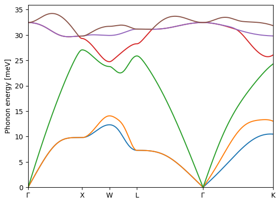

# How to reproduce real time DMD pipeline from scratch?
## JDFTx
[JDFTx](https://jdftx.org) is the first principles code that is used to do SCF, phonon, and wannier calculations before running 
the DMD calculations. The JDFTx source code is available from [github](https://github.com/shankar1729/jdftx/tags). You can download 
it to directly to the cluster, for example, the following command,
   
```wget https://github.com/shankar1729/jdftx/archive/refs/tags/v1.7.0.tar.gz```
  
will download the version 1.7 of the code. The tar ball can be unarchived and decompressed using the following command, 

```tar -xvzpf v1.7.0.tar.gz```. 

Once uziped change to the main directory, ```/home/PATH_TO_CODE/jdftx-1.7.0```, replace PATH_TO_CODE with actual path relative to your home directory.
From inside the main directory if you issue command ```ls```, you will see something very similar to the following:   
```Dockerfile  fluid1D  generate_tarball.sh  jdftx```.   

Here you can issue the command, ```mkdir build```, to create the build directory 
where the compiled code or executables would be saved. Now using command ```cd build``` change to the build directory. Inside the build directory
using a text editor of your choice create a text file (```make.sh``` for example, name is really not important) and save the following script in it and issue ```sh make.sh```. 

```cmake
# for UCSC lux cluster using gcc compilers

module load openmpi/gcc/64/1.10.7

#Configure:
CC=mpicc CXX=mpicxx cmake \
   -D EnableMKL=yes \
   -D MKL_PATH="/cm/shared/apps/intel/mkl" \
   -D EnableScaLAPACK=yes \
   -D GSL_PATH="/cm/shared/apps/gsl/2.6" \
   -D ForceFFTW=yes \
   -D FFTW3_PATH="/cm/shared/apps/fftw/fftw-3.3.8" \
   -D EnableLibXC=yes \
   -D LIBXC_PATH="/home/YOUR_USERNAME/Programs/lib/libxc-6.0.0" \
   -D EnableProfiling=yes \
   ../jdftx/

make -j8
```

```cmake
# for stampede2 using intel compilers

module load intel/18.0.2 impi/18.0.2 gsl/2.6

#Configure:
CC=mpicc CXX=mpicxx cmake \
   -D EnableMKL=yes \
   -D MKL_PATH="$TACC_MKL_DIR" \
   -D EnableScaLAPACK=yes \
   -D GSL_PATH="$TACC_GSL_DIR" \
   -D ForceFFTW=yes \
   -D FFTW3_PATH="$TACC_FFTW3_PATH" \
   -D EnableLibXC=yes \
   -D LIBXC_PATH="/home/YOUR_USERNAME/Programs/lib/libxc-6.0.0" \
   -D EnableProfiling=yes \
   ../jdftx/

make -j8
```

There are several bits in the above script which are specific to the HPC platform that you are working with. For example
```module load openmpi/gcc/64/1.10.7``` tells cmake which compilers to use. In this case it instructors to use ```gcc```. Moreover the exact module 
```openmpi/gcc/64/1.10.7``` may not be available. You may want to use ```module avail``` command to check which ```openmpi``` or ```impi``` modules
are available and change accordingly. 

The other platform dependent bits are values of ```MKL_PATH```, ```GSL_PATH```, and ```FFTW3_PATH``` and would need to be changed.
So far the four applications, ```gcc``` or ```icc```, ```MKL```, ```GSL```, and ```FFTW3```, we have discussed are very common to scientific computing
and most HPC platforms will have them already. You would not need to install them. Just find out how to correctly access them. The ```LibXC``` library, 
however, is not usually available on most platforms and you may need to build it yourself and then provide its path to the cmake script above. 

Although a basic compilation can be done without some of the optional libraries but the DMD calculations are computationally expensive and would 
need an optimally customized build. The above script does just that. Also these are condensed instructions to get one started quickly. For comprehensive
information on how to build a fully customized JDFTx code please consult the [JDFTx](https://jdftx.org/Compiling.html) documentation from the developers.

**Note:** For DMD calculations a separate code FynWann is also needed. FynWann uses JDFTx as a library and would give a compile time error if original JDFTx is not
compiled with the profiling option enabled, ```EnableProfiling=yes```.

### Building Libxc
Libxc is a library of exchange-correlation functionals for density functional theory. You can get the library from [Gitlab](https://gitlab.com/libxc/libxc/-/releases), for example, using the ```wget``` command from within the cluster;   
```wget https://gitlab.com/libxc/libxc/-/archive/6.0.0/libxc-6.0.0.tar.gz```.   
Next decompress it with,    
```tar -xvfz libxc-6.0.0.tar.gz```.
After that change to the main directory ```/PATH_TO_LIBRARY/libxc-6.0.0```. If you do not see the ```configure``` file in the main directory, you can create one by issuing:   

```autoreconf -i```.

After that you can issue the following commands in order to build the directroy:

```
CFLAGS="$CFLAGS -std=gnu99" ./configure --enable-shared --prefix="/PATH_TO_LIBRARY/libxc-6.0.0"
make
make check
make install
```   
**Note 1:** The libxc has some code which requires to be compiled with C99 standard, that is why without the compiler flag ```-std=gnu99``` libxc would not compile.   
**Note 2:** JDFTx is built both as an executable and a library (shared object). That is why it is required that libxc is built as a shared object as well otherwise you will have problem compiling JDFTx with libxc. That is why the configure option ```--enable-shared``` is very important.  

### FeynWann

FeynWann is another code which works with JDFTx (and needs compiled JDFTx to compile) to perform important energy calculations and inialiazations for
the DMD calculations. The code is not publically available yet. If you are working on the project you will have private access to it. Download the code and save it at the same location where your JDFTx ```build``` direcotry is. Make a new directory, say, ```build-FeynWann```, and change to it. Inside this directroy save the following script to a file ```make-FeynWann.sh```. 

```cmake
#!/bin/bash
# for building FeynWann on lux
module load openmpi/gcc/64/1.10.7

CC=mpicc CXX=mpicxx cmake \
 -D JDFTX_BUILD="../build" \
 -D JDFTX_SRC="../jdftx" \
 -D ForceFFTW=yes \
 -D FFTW3_PATH="/PATH_TO_LIBRARY/fftw-3.3.8" \
 -D EnableMKL=yes \
 -D MKL_PATH="/PATH_TO_MKL/mkl" \
 -D EnableScaLAPACK=yes \
 -D GSL_PATH="/PATH_TO_LIBRARY/gsl/" \
 -D EnablePETSc=yes \
 -D PETSC_PATH="/PATH_TO_LIBRARY/petsc-3.18.4-build" \
 -D MPISafeWrite=no \
../FeynWann

make -j4
```
### PETSc 
The PETSc library optionally used by FeynWann may not be available on some systems. Here is how to install. Download it from [here](https://petsc.org/release/install/download/#recommended-obtain-release-version-with-git). Inside the main directory make a new directory called ```build``` and run the configure command with following options,

```./configure --prefix=/PATH_TO_LIBRARY/petsc-3.18.4/build --with-blaslapack-dir=/PATH_TO_MKL/mkl --with-mpi-dir=/PATH_TO_OPENMPI/openmpi/gcc/64/1.10.7```.

The configure command prints the next command to run, if there is no problem with the configure options. Run those commands in sequence one after the other to complete the PETSc installation. 

The above setup is required for first of the two parts of DMD simualtions. This part helps obtain the electronic and phonon structure at the Kohn-Sham level and necessary initializations for the DMD calculations. At this stage it is best to run through an example calculation to obtain the electronic and phonon structure using JDFTx. 
## GaAs
We take the example of GaAs for this purpose and first compute its electronic structure. There are two algorithms to find the converged electronic ground state. We first perform SCF and then use the variational minimize - this helps obtain a fully coverged ground state relatively quickly. For the SCF calculations you need input file - very later convenience - split into two files, ```common.in``` and ```scf.in```. 

```
# save this in common.in

lattice face-centered Cubic 10.6829
ion-species Ga_nv3_nocorecorr.upf
ion-species As_nv5_nocorecorr.upf
elec-cutoff 17

ion Ga 0.00 0.00 0.00  0
ion As 0.25 0.25 0.25  0

elec-n-bands 34
converge-empty-states yes
spintype spin-orbit

elec-ex-corr mgga-x-scan mgga-c-scan
```

```
# save this in scf.in

include common.in

kpoint-folding 16 16 16    #Use a Brillouin zone mesh

initial-state totalE.$VAR

electronic-scf energyDiffThreshold 1e-8

dump-name totalE.$VAR
dump Init Symmetries
dump End State
```
These two ```.in``` files specify the structure and other simulations parameters. Along with these two files, you also need to specify either the part to the directory which has pseudopotentials or save the pseudopotential files in the same directory. The pseudpotentials used in this example are available from here,  and .
### Electronic band structure


### Phonon band structure

